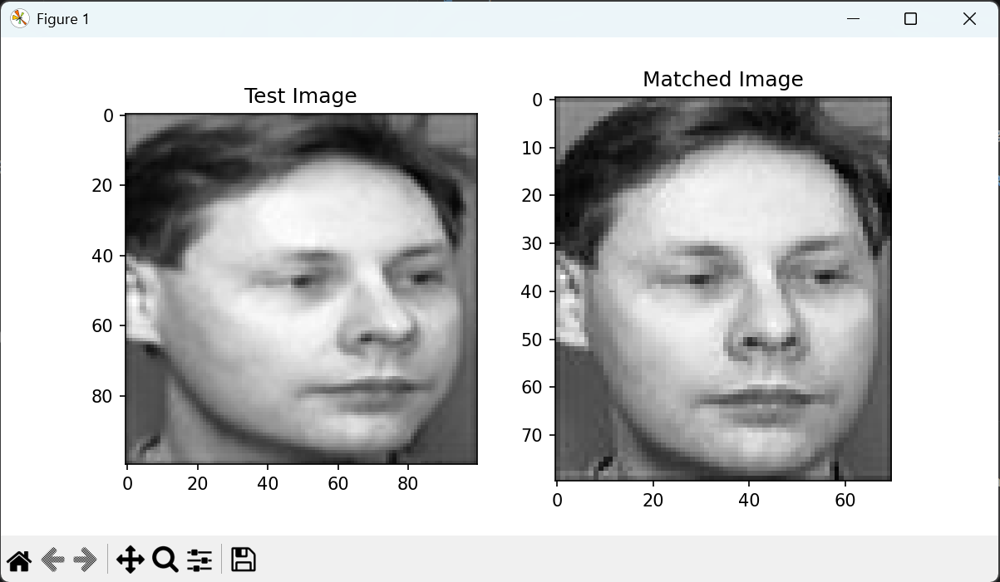
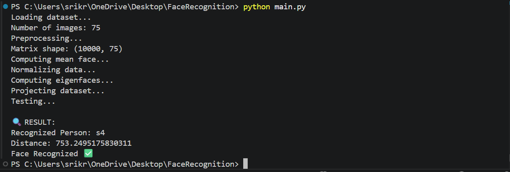

# Face Recognition using Eigenfaces

## Overview

This project implements a **Face Recognition System** using the **Eigenfaces algorithm** and **Principal Component Analysis (PCA)**.
It applies fundamental **Linear Algebra concepts** such as eigenvalues, eigenvectors, covariance matrices, and dimensionality reduction to recognize and match human faces from a dataset.

The system compares a given test image with trained dataset images and identifies the closest matching face based on Euclidean distance in eigenspace.

---

## Features

* Face recognition using Eigenfaces
* PCA-based dimensionality reduction
* Mean face computation
* Dataset preprocessing and normalization
* Face matching using Euclidean distance
* Visualization of test and matched images
* Console-based recognition output

---

## Concepts Used

* Linear Algebra
* Eigenvalues & Eigenvectors
* Principal Component Analysis (PCA)
* Covariance Matrix
* Dimensionality Reduction
* Euclidean Distance
* Image Vectorization

---

## Technologies Used

* Python
* NumPy
* Matplotlib
* OpenCV
* Pillow

---

## Project Structure

```bash
FaceRecognition/
│
├── dataset/                  # Training dataset images
├── test/                     # Test images
├── outputs/                  # Output screenshots
│   ├── comparison.png
│   └── terminal_output.png
│
├── main.py                   # Main implementation
├── requirements.txt          # Required libraries
└── FaceRecognition_Report.docx
```

---

## Workflow

1. Load dataset images
2. Convert images into vectors
3. Compute mean face
4. Normalize dataset
5. Generate covariance matrix
6. Compute eigenfaces using PCA
7. Project images into eigenspace
8. Compare test image with dataset
9. Display matched face and recognition result

---

## Sample Output

### Face Comparison

Displays:

* Test Image
* Matched Image

### Terminal Output

Shows:

* Recognized Person ID
* Distance Score
* Recognition Status

---

## Output Screenshots

### Comparison Result



### Terminal Output



---

## Installation

Clone the repository:

```bash
git clone https://github.com/kruthivankadara-dev/Face-Recognition-Using-Eigenfaces.git
```

Navigate to the project folder:

```bash
cd Face-Recognition-Using-Eigenfaces
```

Install required libraries:

```bash
pip install -r requirements.txt
```

Run the project:

```bash
python main.py
```

---

## Future Improvements

* Real-time webcam face recognition
* Deep learning-based face embeddings
* Face detection integration
* Web application deployment
* Larger and more diverse datasets

---

## Applications

* Biometric authentication
* Attendance systems
* Surveillance systems
* Identity verification
* Smart security systems

---

## Authors

**Vankadara Sri Kruthi**
**Yeshaswinie.D**
**Valmiki Uma**

